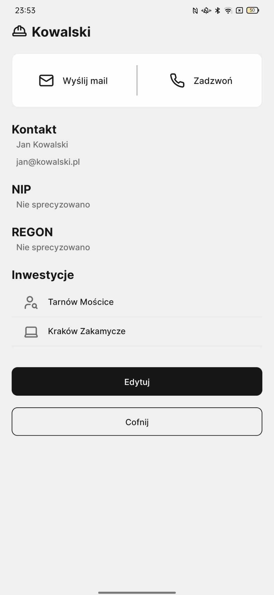
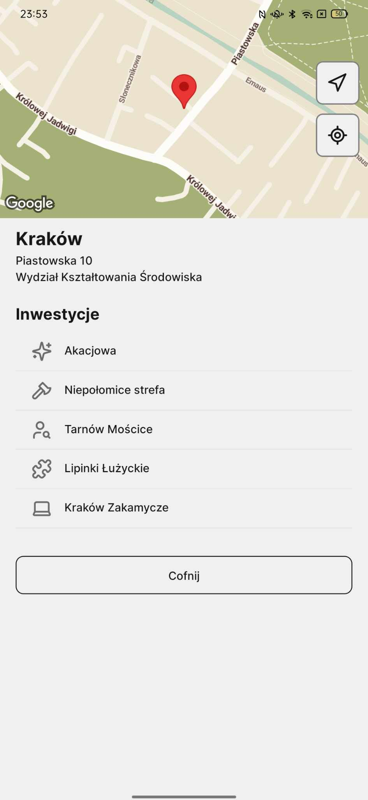

# hedgeapp mobile :hedgehog:

Mobile app created to streamline and enhance the inventory processes for individuals and teams managing green areas.

## preview :eye:

| List of investments                                                                               | Investment details                                                                               | Investor details                                                                                  | Office details                                                                                    |
| ------------------------------------------------------------------------------------------------- | ------------------------------------------------------------------------------------------------ | ------------------------------------------------------------------------------------------------- | ------------------------------------------------------------------------------------------------- |
|  |  |  |  |

## tech stack :wrench:


## dev quickstart :construction:

```bash
$ bun install
$ bun run ios/android
```

## eas build :truck:

```bash
eas build --platform android --profile development
eas build --platform ios --profile development
```

---

## project structure :deciduous_tree:

```bash
.
├── README.md
├── app.json
├── babel.config.js
├── bun.lockb
├── eas.json
├── expo-env.d.ts
├── package.json
├── src
│   ├── api
│   ├── app
│   │   ├── (auth)
│   │   ├── (tabs)
│   │   ├── investments
│   │   ├── investors
│   │   ├── modal.tsx
│   │   └── offices
│   ├── assets
│   │   ├── fonts
│   │   ├── icons
│   │   └── images
│   ├── components
│   ├── constants
│   ├── context
│   ├── models
│   ├── redux
│   ├── types
│   └── utils
└── tsconfig.json
```
